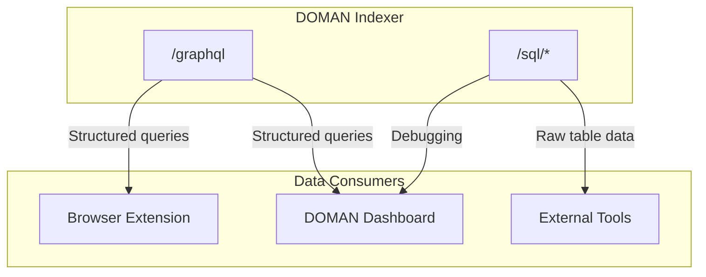

# API Reference

The indexer exposes a Hono-based API server with two query interfaces: **GraphQL** and **SQL**.

---

## API Endpoints

| Endpoint | Method | Description |
|---|---|---|
| `/graphql` | POST | GraphQL query endpoint |
| `/` | POST | GraphQL endpoint (alias) |
| `/sql/:table` | GET | Direct SQL table query |

**Production:** [https://doman-indexer.up.railway.app](https://doman-indexer.up.railway.app)
**Local:** `http://localhost:42069`

---

## GraphQL

### Query Scam Votes

```bash
curl -X POST https://doman-indexer.up.railway.app/graphql \
  -H "Content-Type: application/json" \
  -d '{"query": "{ scamVotes { items { reporter targetId isScam } } }"}'
```

### Query Scam Reports

```bash
curl -X POST https://doman-indexer.up.railway.app/graphql \
  -H "Content-Type: application/json" \
  -d '{"query": "{ scamReports { items { reporter reasonHash isScam } } }"}'
```

### Query Users

```bash
curl -X POST https://doman-indexer.up.railway.app/graphql \
  -H "Content-Type: application/json" \
  -d '{"query": "{ users { items { address voteCount reportCount } } }"}'
```

### Available Entity Types

| Entity | Fields |
|---|---|
| `scamVotes` | `id`, `reporter`, `targetId`, `targetType`, `reasonHash`, `isScam`, `timestamp` |
| `scamReports` | `id`, `reporter`, `reasonHash`, `isScam`, `timestamp` |
| `users` | `id`, `address`, `voteCount`, `reportCount` |

---

## SQL

The SQL endpoint provides direct table access for quick lookups and debugging.

### Query All Votes

```bash
curl https://doman-indexer.up.railway.app/sql/scam_vote
```

### Query All Reports

```bash
curl https://doman-indexer.up.railway.app/sql/scam_report
```

### Query Users

```bash
curl https://doman-indexer.up.railway.app/sql/user
```

### Available Tables

| Table | Route |
|---|---|
| `user` | `/sql/user` |
| `scam_vote` | `/sql/scam_vote` |
| `scam_report` | `/sql/scam_report` |

---

## Response Format

### GraphQL

Responses follow the standard GraphQL JSON format:

```json
{
  "data": {
    "scamVotes": {
      "items": [
        {
          "reporter": "0x1234...",
          "targetId": "0xabcd...",
          "isScam": true
        }
      ]
    }
  }
}
```

### SQL

Responses return JSON arrays of row objects:

```json
[
  {
    "id": 1,
    "reporter": "0x1234...",
    "targetId": "0xabcd...",
    "targetType": 0,
    "reasonHash": "0xef01...",
    "isScam": true,
    "timestamp": 1714300000
  }
]
```

---

## Integration with DOMAN



The GraphQL endpoint is preferred for structured queries with filtering and pagination. The SQL endpoint is useful for quick lookups, debugging, and data exports.
