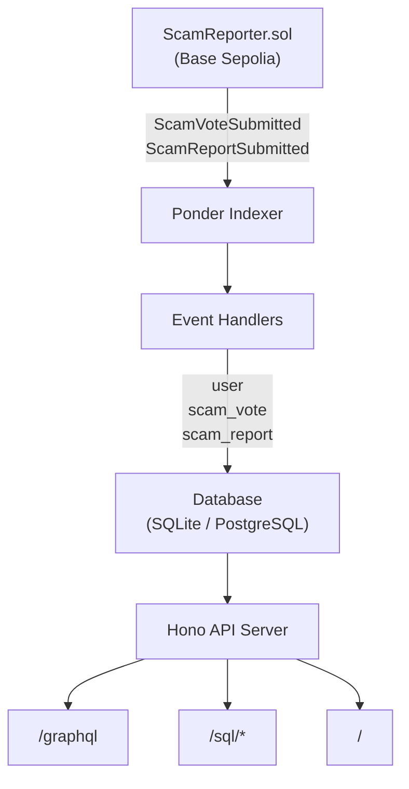
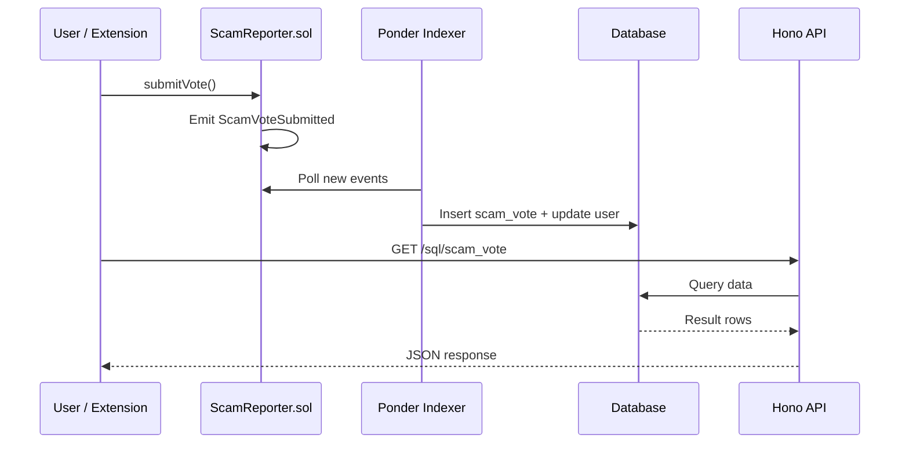

# DOMAN Indexer

Blockchain indexer service for the **ScamReporter** smart contract on Base Sepolia testnet. Indexes on-chain scam report and vote events, then exposes the data through GraphQL and SQL APIs.

Built with [Ponder](https://ponder.sh/) — a TypeScript-based blockchain indexing framework.

**Live API:** [https://doman-indexer.up.railway.app](https://doman-indexer.up.railway.app)

> The indexer is the bridge between on-chain events and off-chain queries. It ensures every `ScamVoteSubmitted` and `ScamReportSubmitted` event is captured, stored, and queryable in real time.

---

## Architecture



### Event Flow



---

## Indexed Data

### Tables

| Table | Description |
|---|---|
| `user` | Wallet addresses with aggregated vote and report counts |
| `scam_vote` | Individual scam votes on specific targets |
| `scam_report` | Scam reports submitted by users |

### Monitored Events

| Event | Trigger | Indexed Fields |
|---|---|---|
| `ScamVoteSubmitted` | `submitVote()` called | `reporter`, `targetId`, `targetType`, `reasonHash`, `isScam` |
| `ScamReportSubmitted` | `submitReport()` called (legacy) | `reporter`, `reasonHash`, `isScam` |

---

## Smart Contract

| Property | Value |
|---|---|
| Name | ScamReporter |
| Network | Base Sepolia (Chain ID: 84532) |
| Address | [`0x65534f1A1BbCa98AD756c7CE38D7097fBA7C237a`](https://sepolia.basescan.org/address/0x65534f1A1BbCa98AD756c7CE38D7097fBA7C237a) |
| Start Block | 40726553 |

---

## Tech Stack

| Component | Technology | Version |
|---|---|---|
| Indexing Framework | Ponder | 0.16.6 |
| Web Framework | Hono | - |
| Ethereum Library | Viem | - |
| Language | TypeScript | - |
| Database (default) | SQLite | - |
| Database (optional) | PostgreSQL | - |

---

## Project Structure

```
doman-indexer/
├── abis/
│   └── ScamReportAbi.ts        # Smart contract ABI
├── src/
│   ├── api/
│   │   └── index.ts            # GraphQL & SQL API endpoints
│   └── ScamReporter.ts         # Event handler indexing logic
├── generated/
│   └── schema.graphql          # Auto-generated GraphQL schema
├── ponder.config.ts            # Ponder configuration (chain & contract)
├── ponder.schema.ts            # Database schema definition
├── package.json
├── tsconfig.json
├── nixpacks.toml               # Railway deployment config
└── .node-version               # Node.js version (20)
```

---

## Pages

| Page | Description |
|------|-------------|
| [Setup & Deployment](/indexer/setup) | Installation, configuration, scripts, and Railway deployment |
| [API Reference](/indexer/api) | GraphQL and SQL endpoint usage examples |
