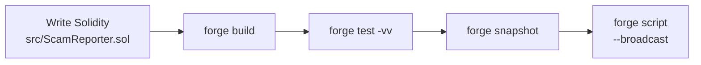
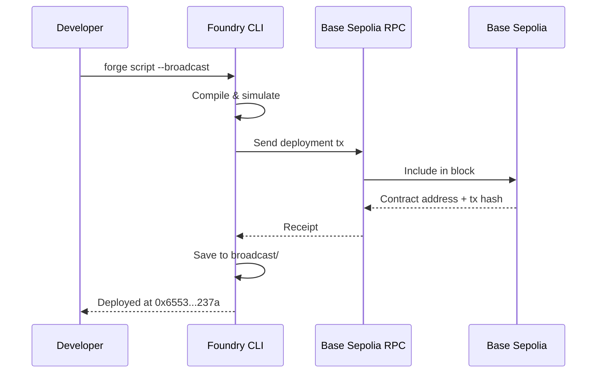
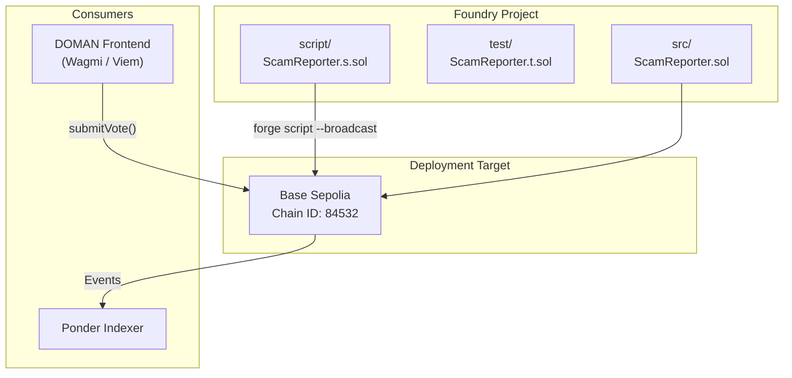

# Contract Development

---

## Prerequisites

- [Foundry](https://book.getfoundry.sh/) (forge, cast, anvil)
- Node.js (for frontend integration)

---

## Setup

```shell
git clone <repo-url>
cd doman-contracts
forge install
```

Create a `.env` file:

```env
PRIVATE_KEY=your_private_key
BASE_RPC_URL=https://sepolia.base.org
```

---

## Development Workflow



---

## Build

```shell
forge build
```

---

## Test

```shell
forge test -vv
```

---

## Deploy

```shell
forge script script/ScamReporter.s.sol:ScamReporterScript \
  --rpc-url base-sepolia \
  --private-key $PRIVATE_KEY \
  --broadcast
```

### Deployment Flow



---

## Gas Snapshot

```shell
forge snapshot
```

---

## Foundry CLI Reference

```shell
$ forge --help
$ anvil --help
$ cast --help
```

---

## Tech Stack

| Layer | Technology |
|---|---|
| Smart Contracts | Solidity ^0.8.13 |
| Framework | Foundry |
| Blockchain | Base Chain (Sepolia testnet) |
| Off-chain DB | PostgreSQL (Supabase) |
| Indexer | Ponder |
| Frontend | Next.js 16, React 19, Wagmi v3, Viem |

---

## Architecture Overview


