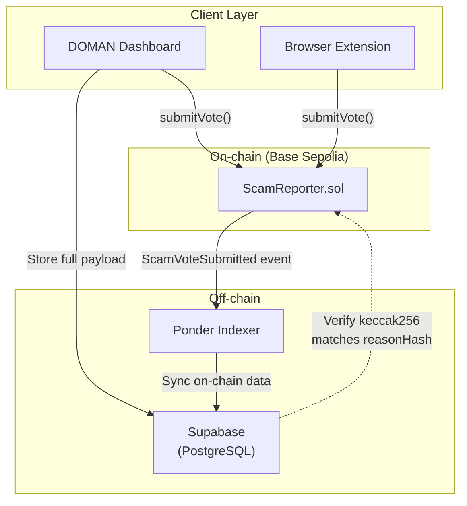
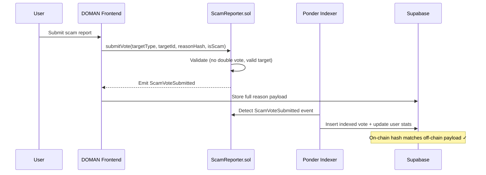

# DOMAN Smart Contracts

On-chain scam reporting and community voting contracts for the **DOMAN** platform — a community-powered security engine for Base chain.

> DOMAN protects users from phishing sites, scam addresses, and risky smart contracts through community-driven reporting and automated detection.

---

## Contracts

| Contract | Description |
|---|---|
| [ScamReporter](/smart-contracts/scam-reporter) | Decentralized scam-report vote submission with anti-double-vote enforcement |

---

## On-chain / Off-chain Architecture

All report data lives off-chain (Supabase). The smart contract acts as an **integrity anchor** — it proves that a given `(reporter, reasonHash, isScam)` triple was witnessed by the chain at a specific block.



### Report Lifecycle



1. **User** submits a report via DOMAN Dashboard or Extension.
2. **Frontend** calls `submitVote()` on-chain and stores the full payload in Supabase.
3. **Indexer** (Ponder) listens for `ScamVoteSubmitted` events and syncs on-chain data with the database.
4. **Verification** — anyone can recompute `keccak256(offchainPayload)` and verify it matches `reasonHash` in the event log.

---

## Deployed Contracts

| Network | Chain ID | Contract Address |
|---|---|---|
| Base Sepolia | 84532 | [`0x65534f1a1bbca98ad756c7ce38d7097fba7c237a`](https://sepolia.basescan.org/address/0x65534f1a1bbca98ad756c7ce38d7097fba7c237a) |

---

## Project Structure

```
doman-contracts/
├── src/
│   └── ScamReporter.sol       # Main contract
├── test/
│   └── ScamReporter.t.sol     # Unit & fuzz tests
├── script/
│   └── ScamReporter.s.sol     # Deploy script
├── broadcast/                  # Deployment artifacts
├── lib/                        # Foundry dependencies
└── foundry.toml               # Foundry configuration
```

---

## Pages

| Page | Description |
|------|-------------|
| [ScamReporter Contract](/smart-contracts/scam-reporter) | Functions, events, errors, and hash generation |
| [Development](/smart-contracts/development) | Setup, build, test, deploy with Foundry |
