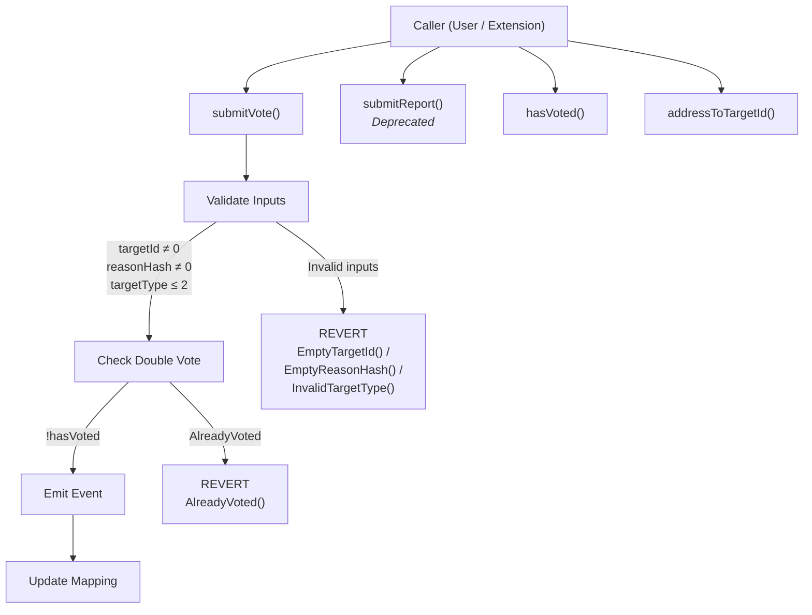
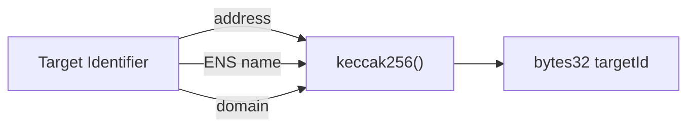
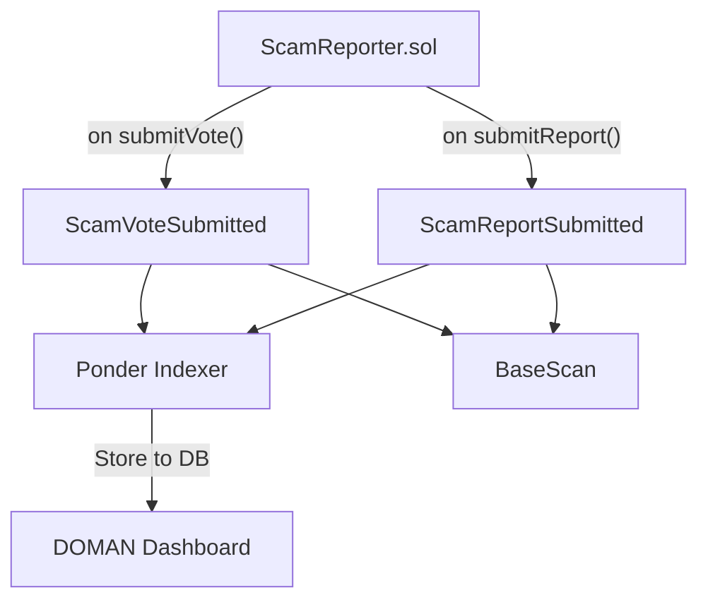

# ScamReporter Contract

The `ScamReporter` contract is the on-chain integrity anchor for DOMAN's community reporting system. All report data lives off-chain (Supabase); this contract proves that a given `(reporter, reasonHash, isScam)` triple was witnessed by the chain at a specific block.

---

## Contract Internal Flow



---

## Key Features

- **Target-scoped voting** — Reports are tied to a specific target (address, ENS, or domain) via a `targetId` hash.
- **Anti-double-vote** — Each `(targetId, reporter)` pair can only vote once, enforced on-chain.
- **Gas-efficient** — Payload strings stay off-chain; only `keccak256` hashes are stored/emitted.
- **Indexer-friendly events** — Indexed fields allow efficient filtering by reporter, target, or reason hash.

---

## Target Types

| Value | Name | Description |
|---|---|---|
| `0` | `ADDRESS` | Wallet or contract address on Base |
| `1` | `ENS` | ENS name (e.g. `scammer.eth`) |
| `2` | `DOMAIN` | Web domain (e.g. `phishing-site.com`) |



---

## Functions

### `submitVote(uint8 targetType, bytes32 targetId, bytes32 reasonHash, bool isScam)`

Submit a target-scoped scam vote. This is the primary method for community reporting.

| Parameter | Type | Description |
|---|---|---|
| `targetType` | `uint8` | Target type: `0`=ADDRESS, `1`=ENS, `2`=DOMAIN |
| `targetId` | `bytes32` | `keccak256` hash of the normalized target identifier. Must not be zero. |
| `reasonHash` | `bytes32` | `keccak256` of the off-chain reason payload. Must not be zero. |
| `isScam` | `bool` | `true` if the reporter considers the target a scam |

**Reverts with:**

| Error | Condition |
|---|---|
| `EmptyTargetId()` | `targetId` is `bytes32(0)` |
| `EmptyReasonHash()` | `reasonHash` is `bytes32(0)` |
| `InvalidTargetType()` | `targetType` > 2 |
| `AlreadyVoted(targetId, reporter)` | Caller already voted for this `targetId` |

### `submitReport(bytes32 reasonHash, bool isScam)`

> **Deprecated** — Legacy target-agnostic method. Use `submitVote` instead.

### `hasVoted(bytes32 targetId, address reporterAddr) → bool`

Check if an address has already voted for a given target.

### `addressToTargetId(address target) → bytes32`

Utility to convert an address to a normalized `bytes32` target ID: `bytes32(uint256(uint160(target)))`.

---

## Events

### `ScamVoteSubmitted`

```solidity
event ScamVoteSubmitted(
    address indexed reporter,
    bytes32 indexed targetId,
    uint8 targetType,
    bytes32 reasonHash,
    bool isScam
);
```

Emitted on every `submitVote` call. Primary event for off-chain indexers (e.g. Ponder).

### `ScamReportSubmitted`

```solidity
event ScamReportSubmitted(
    address indexed reporter,
    bytes32 indexed reasonHash,
    bool isScam
);
```

Emitted by the legacy `submitReport` method.

### Event Consumption



---

## Generating `targetId` and `reasonHash`

```javascript
import { keccak256, toBytes } from "viem";

// For an address target
const targetId = keccak256(toBytes("0xScammerAddress..."));

// For an ENS target
const targetId = keccak256(toBytes("scammer.eth"));

// For a domain target
const targetId = keccak256(toBytes("phishing-site.com"));

// Reason hash — hash the full reason payload from off-chain
const reasonHash = keccak256(toBytes("This address stole funds via a fake airdrop..."));
```

The off-chain indexer (Supabase listener) can verify on-chain/off-chain consistency by recomputing the `keccak256` of the stored reason payload and comparing it to `reasonHash` in the event log.
